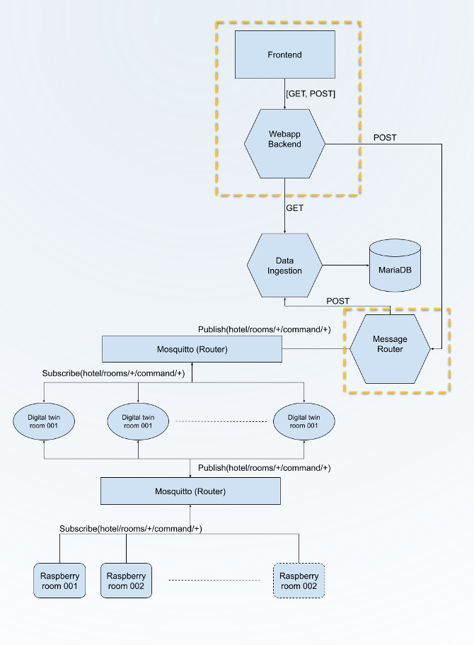
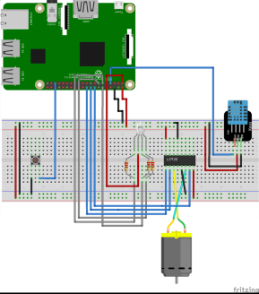

# Operating Systems Desing: Final Challenge
By Luis Daniel Casais Mezquida, Iván Darío Cersósimo and Hashim Mahmood  
Operating Systems Design 21/22
Bachelor's Degree in Computer Science and Engineering, grp. 89  
Universidad Carlos III de Madrid

Implementation of an IOT solution for a Smart Hotel.


## Index
1. [Problem description](#problem-description)
2. [IOT Solution](#iot-solution)
    1. [Architecture](#architecture)
        1. [MQTTs](#mqtts)
        2. [Raspberry Pi](#raspberry-pi)
        3. [Digital Twin](#digital-twin)
        4. [Message Router](#message-router)
        5. [Data Ingestion microservice/ReST API](#data-ingestion-microservicerest-api)
        6. [Webapp Backend/ReST API](#webapp-backendrest-api)
        7. [Frontend](#frontend)
    2. [Implementation](#implementation)
        1. [`raspberry`](#raspberry)
        2. [`digital_raspberry`](#digitalraspberry)
        3. [`mqtt-1` & `mqtt-2`](#mqtt-1--mqtt-2)
            1. [Topics](#topics)
            2. [Subscriptions](#subscriptions)
        4. [`digital_twin`](#digitaltwin)
        5. [`message_router`](#digitaltwin)
        6. [`mariaDB`](#mariadb)
        7. [`adminer`](#adminer)
        8. [`data_ingestion_microservice`](#dataingestionmicroservice)
        9. [`frontend`](#frontend)
3. [Execution](#execution)
4. [Use, debugging & other commands](#use-debugging--other-commands)
    1. [MariaDB](#mariadb)
    2. [Adminer](#adminer)
    3. [Frontend](#frontend)


## Problem description
Hotel Kilombo wants to upgrade its facilities, making use of new IOT technologies to upgrade all of their 400 rooms to Smart Rooms. These rooms will be equiped with air conditioning, electric blinds, inner and externar lights.  
All these elements will be controlled by a smart system, that will also display information about the room (temperature, humidity, presence), and could be managed (for all 400 rooms) through a website.  
For example, air conditioner will automatically turn on/off and be hot/cold depending on the current temperature, and lights could be turned automatically on if a presence is detected.


## IOT Solution
To implement the solution, we will use Raspberry Pies to get sensor data from each room, and to control the elements of the room (lights, etc.), and some machines to manage the information and host the website.  
The data from the sensors and the other elements will be saved in a database, accesible through the frontend.  
Throught the frontend, the user will be able to get the state information from all rooms, and interact with the rooms (turn light on/off, etc.).
  
### Architecture
The diagram for the architecture of the implementation is the following:  


  
The architecture consists of the Raspberry Pies, two MQTT routers (MQTT-1, the top one, and MQTT-2, the bottom one), Digital Twins, a Message Router, the Data Ingestion ReST API, a MariaDB DBMS, and the website Frontend and Webapp Backend ReST API.

#### MQTTs
The MQTTs are routers using the Publish-Subscribe pattern.  
They allow clients to connect to them, and send messages to a specific topic. Clients can also subscribe to topics, and all messages sent with that topic are passed to that client.  
Message Router and the Digital Twins are clients of MQTT-1, and the RPis and the Digital Twins are clients of MQTT-2.

#### Raspberry Pi
Each Raspberry Pi will be in a room, and read humidity, temperature and presence of the room through the sensors, sending it through MQTT-2, topic `hotel/rooms/<room_id>/telemetry/<sensor/device>`. It will also send information about the state of the devices (AC, blinds and lights).   
Depending on the temperature, it will turn on/off and cold/hot the AC.  
The RPis will also subscribe to the topic `hotel/rooms/<room_id>/command/<command>` in order to receive commands from the frontend (turn lights on, etc.), and manage the devices. 

#### Digital Twin
The Digital Twins are an intermediate layer between the Raspberry Pies and the Message Router.  
They are connected to both MQTTs, and receive the information from the RPis through MQTT-2 (therefore they are subscribed to `hotel/rooms/+/telemetry/+`). If the information has changed from the last time, they pass that information to the Message Router, through the MQTT-1, and the topic `hotel/rooms/<room_id>/telemetry/<sensor/device>`. They also relay the commands from the router to the RPis (therefore they are subscribed to `hotel/rooms/<room_id>/command/+`).  
In order to configure the room, that is, to get its room id, they publish their hostname to `hotel/rooms/<hostname>/config` and wait for the response (the assigned room id) from the message router (so they are subscribed to `hotel/rooms/<hostname>/config/rooms`).  

#### Message Router
The message router gets the information from the Digital Twins and sends it to de Data Ingestion ReST API.  
It is also in charge of configuring, and saving, the room ids for the Digital Twins, waiting for the message and subscribing to the topic `hotel/rooms/+/config`, and publishing the id in `hotel/rooms/<hostname>/config/rooms`.  
And finally, it relays the commands from the backend through `hotel/rooms/<room_id>/command/<command>`. For this, it also implements a small ReST API inside it.

#### Data Ingestion microservice/ReST API
This microservice receives the data from the message router and storing it in the MariaDB.  
It's also in charge of fetching data from the MariaDB when it's requested by the backend.

#### MariaDB DBMS
This DataBase Management System is in charge of storing the sensors/devices state, with the timestamp.

#### Webapp Backend/ReST API
This API is in charge of managing the requests sent from the Frontend.  
It asks for the data to the Data Ingestion microservice, and passes the commands to the Message Router.

#### Website Frontend


### Implementation
We've chosen to use Docker and Docker-compose to implement our solutions, for its reliability, ease of use, and scalability.  
Two machines will be needed to run the management, plus one RPi per room. The first machine, DigitalTwin, will host the Digital Twins, while the second one, IOTServices, will host the rest (MQTTs, Data Ingestion, MariaDB, Message Router, Adminer, Webapp Backend and Frontend).  
This is prepared to be deployed on two virtual machines, but it also works for real machines (that is, running Linux).  
  
One Docker container will be used for each element (except `raspberry`).

#### `raspberry`
This is to be run on an actual Raspberry Pi.  
  
The RPi is connected to a circuit with a temperature & humidity sensor (DHT11), a button (to test presence), a DC motor (for the AC), a servo motor (for the blinds), and some LEDs: one RGB LED for signaling the state of the AC, one white for the inner light and another yellow for the exterior light.  
It does nothing until the button is pressed, that is, until presence is detected. If the button is pressed again, it understand there is no presence anymore.  
While there is presence, it reads the temperature and humidity of the room and, depending on the temperature, it turns the motor backwards (pump hot air, if temperature < 21ºC or forwards (pump cold air, if temperature > 24ºC). Using Pulse Width Modulation, the motor is run faster the further away from the limit temperature it is, that is, the hotter it is, the more cold air is pushed. If temperature is between 21ºC and 24ºC, the motor stays on standby.  
The RGB LED signals the state of the AC: it turs blue if it's in cold mode, red if it's in hot mode, and green if it's in standby.  
The servo motor...  
The other lights...  
  
The raspberry is also able to receive commands from the MQTT-2, which overwrite its state, and are able to control the devices.  
The commands are:
- dfasd
  
Each 5 seconds, regardless of presence, the raspberry sends all of its device/sensor information to the MQTT-2.  
  
_Note that each RPi has to have a hard-wired `ROOM_ID`._

#### `digital_raspberry`
This is not used in the final implementation (that's why it's commented out on the docker-compose), but it's quite useful for testing purposes.  
It emulates the Raspberry Pies, generating random device/sensor data and sending it to the MQTT-2, as a real RPi would do.

#### `mqtt-1` & `mqtt-2`

##### Topics
The topics implemented on the MQTTs are the following:
- Config: `hotel/rooms/<id>/config` (only MQTT-1)  
This topic is used as a "handshake" between a Digital Twin and the Message Router, in order to get assigned a room id.  
The Digital Twin sends its id (docker container id) when it's connected.
    - `/rooms`: When the Message router receives
- Telemetry: `hotel/rooms/<room>/telemetry`  
sdf
    - `/temperature`:  
    Pakage structure: `{ "active": <bool>, "value": <int (ºC)> }`
    - `/humidity`:  
    Pakage structure: `{ "active": <bool>, "value": <int (%)> }`
    - `/presence`:  
    Pakage structure: `{ "active": <bool>, "value": <bool> }`
    - `/blinds`:  
    Pakage structure: `{ "active": <bool>, "value": <int (%)> }`
    - `/temperature`:  
    Pakage structure: `{ "active": <bool>, "value": <int (ºC)> }`
    - `/air`: hkjhf  
    Pakage structure: `{ "active": <bool>, "mode": <"cold" | "hot" | "off">, "value": <int from 0 to 100 (%)> }`
    - `/inner-light`: hkjhf  
    Pakage structure: `{ "active": <bool>, "on": <bool>, "value": <int from 0 to 100 (%)> }`
    - `/exterior-light`: hkjhf  
    Pakage structure: `{ "active": <bool>, "on": <bool>, "value": <int from 0 to 100 (%)> }`

- Commands: `hotel/rooms/<room>/command`  
These commands are sent from the frontend to the RPis, in order to change the behaviour of its devices.
    - `/air-mode`: Change the air conditioner mode (cold, hot, off)  
    Pakage structure: `{ "mode": <"cold" | "hot" | "off"> }`
    - `/air-level`: Change the air conditioner intensity  
    Pakage structure: `{ "level": <int from 0 to 100 (%)> }`
    - `/blinds`: Change the value of the blinds  
    Pakage structure: `{ "level": <int from 0 to 180 (º)> }`
    - `/inner-light-mode`: Change the mode of the inner light (on/off)  
    Pakage structure: `{ "on": <bool> }`
    - `/inner-light-level`: Change the intensity of the inner light  
    Pakage structure: `{ "level": <int from 0 to 100 (%)> }`
    - `/exterior-light-mode`: Change the mode of the exterior light (on/off)  
    Pakage structure: `{ "on": <bool> }`
    - `/exterior-light-level`: Change the intensity of the exterior light  
    Pakage structure: `{ "level": <int from 0 to 100 (%)> }`

##### Subscriptions
Each client is subscribed to different topics, as such:
- MQTT-1:
    - `message_router`: `hotel/rooms/+/config`, `hotel/rooms/+/telemetry/+`
    - `digital_twin`: `hotel/rooms/<id>/config/rooms`, `hotel/rooms/<room_id>/command/+`
- MQTT-2:
    - `raspberry`/`digital_raspberry`: `hotel/rooms/<room_id>/command/+`
    - `digital_twin`: `hotel/rooms/<room_id>/telemetry/+`

#### `digital_twin`


#### `message_router`


#### `mariaDB`


#### `adminer`


#### `data_ingestion_microservice`


#### `frontend`

In order to send commands to the RPi, the frontend sends JSONs to the backend.  
The formats, depending on the action, are the following:
- `#air_mode`: Change the air conditioner mode (cold, hot, off)  
Pakage structure: `{ "room": <roomID>, "type": "air-mode", "value": <"cold" | "hot" | "off"> }`
- `#air_level`: Change the air conditioner intensity  
Pakage structure: `{ "room": <roomID>, "type": "air-level", "value": <int from 0 to 100 (%)> }`
- `#blinds`: Change the value of the blinds  
Pakage structure: `{ "room": <roomID>, "type": "blinds", "value": <int from 0 to 180 (º)> }`
- `#inner_light_mode`: Change the mode of the inner light (on/off)  
Pakage structure: `{ "room": <roomID>, "type": "inner-light-mode", "value": <bool> }`
- `#inner_light_level`: Change the intensity of the inner light  
Pakage structure: `{ "room": <roomID>, "type": "inner-light-level", "value": <int from 0 to 100 (%)> }`
- `#exterior_light_mode`: Change the mode of the exterior light (on/off)  
Pakage structure: `{ "room": <roomID>, "type": "exterior-light-mode", "value": <bool> }`
- `#exterior_light_level`: Change the intensity of the exterior light  
Pakage structure: `{ "room": <roomID>, "type": "exterior-light-level", "value": <int from 0 to 100 (%)> }`


## Execution
We need 2 machines (running Debian) to implement this: one for DigitalTwin, and another for IOTServices, plus one Raspberry Pi.  

1. Update the machines and install docker & docker-compose
```bash
sudo apt update && sudo apt upgrade -y
sudo apt install docker docker-compose -y
sudo usermod -aG docker $USER  # not explicitly needed, but recommended
```
2. Update the RPi and install pip
```bash
sudo apt update && sudo apt upgrade
sudo apt install pip -y
```
3. Copy the IP address of the machine that will hold the IOTServices into `DigitalTwin/docker-compose.yaml` (`MQTT_SERVER_ADDRESS` enviroment variable), and into the `backend_api_address` variable inside `IOTServices/frontend/app/js_lib.js`.
4. Make sure port `1883` (MQTT-1) and `1884` (MQTT-2) are open on all machines, and ports `5000` (Data Ingestion ReST API), `5001` (Webapp Backend ReST API), `5002` (Message Router ReST API), `3306` (mariaDB), `8080` (adminer) and `80` (http) are open on the IOTServices machine.
5. Setup the circuit on the Raspberry Pi, as such:  

  

The pins are:

| PIN     | BCM CODE |
| ------- | -------- |
| MOTOR1A | GPIO24   |
| MOTOR1B | GPIO23   |
| MOTOR1E | GPIO25   |
| DHT     | GPIO04   |
| RED     | GPIO17   |
| BLUE    | GPIO18   |
| GREEN   | GPIO27   |
| BUTTON  | GPIO16   |

6. On the IOTServices machine, run:
```bash
cd IOTServices
chmod +x launch_instances.sh
./launch_instances.sh
```
7. On the DigitalTwin machine, run:
```bash
cd DigitalTwin
chmod +x launch_instances.sh
./launch_instances.sh
```
8. On the Raspberry Pi, run:
```bash
cd Raspberry
pip install -r requirements.txt
chmod +x launch.sh
./launch.sh
```


## Use, debugging & other commands

### MariaDB
- To enter the container, run:
```bash
docker exec –it iotservices_mariaDB_1 mysql –u dso_db –pdso_db_password
```
- To enter the database, run:
```sql
use dso_db;
```
- To see the table, run:
```sql
SELECT * FROM device_state ORDER BY date DESC LIMIT 100;
```

### Adminer
Adminer is a web interface for MariaDB.
To access it, go to `<IP of the IOTServices machine>:8080`, and login with:
- System: `MySQL`
- Server: `mariaDB`
- Username: `<MYSQL_USER>`
- Password: `<MYSQL_PASSWORD>`
- Database: `<MYSQL_DATABASE>`

Note that the variables (in <>) are the enviroment variables for mariaDB found on `IOTServices/docker-compose.yaml`.

### Frontend
To access the frontend, go to `<IP of the IOTServices machine>`.
